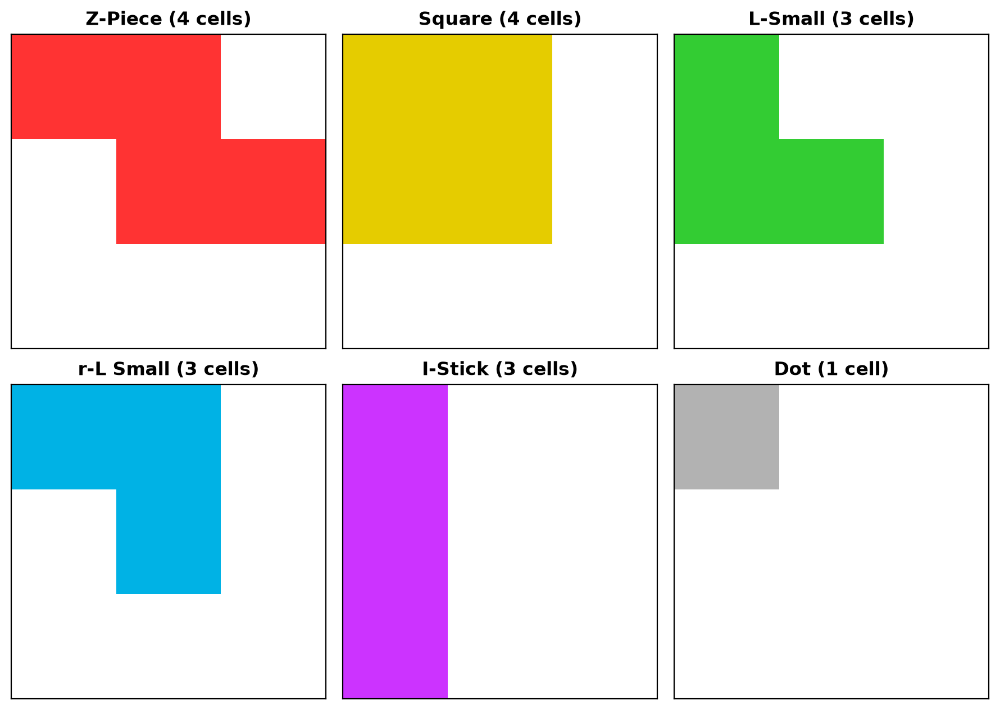
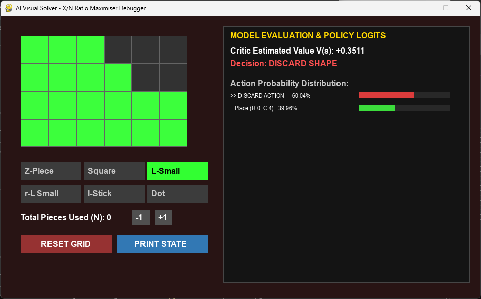
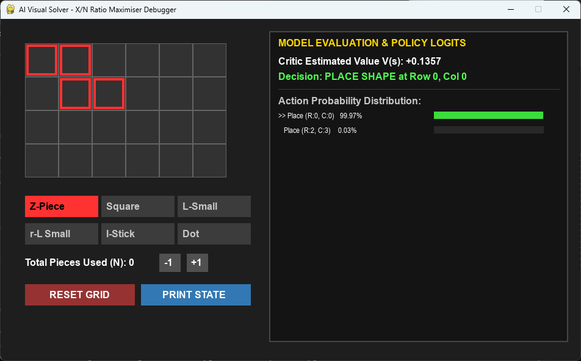
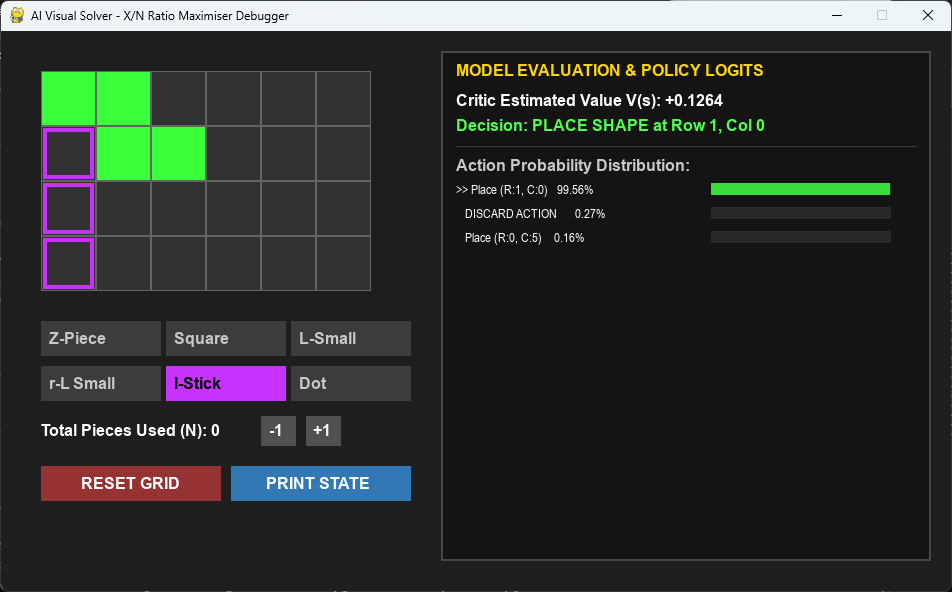

# Fishing Jigsaw Solver


A reinforcement learning agent that learns to solve a tile-packing minigame from **Metin2** as efficiently as possible, trained with [MaskablePPO](https://sb3-contrib.readthedocs.io/) (Stable-Baselines3 Contrib) on a custom Gymnasium environment.

> **Disclaimer:** This project is **not affiliated with, endorsed by, or connected to Metin2, Gameforge, Webzen, or any related companies.** All trademarks and game names belong to their respective owners. It was created **for educational purposes only**, and it does **not** read from or write to the game process in any way. See [Legal & Disclaimer](#legal--disclaimer).

---

## Table of Contents

- [The Minigame](#the-minigame)
- [About This Project](#about-this-project)
- [Benchmark Results](#benchmark-results)
- [Installation](#installation)
- [Usage](#usage)
- [CPU vs GPU](#cpu-vs-gpu)
- [Project Structure](#project-structure)
- [How It Works](#how-it-works)
- [Legal & Disclaimer](#legal--disclaimer)

---

## The Minigame

<!-- TODO: add a screenshot of the minigame here, and any extra rules you want to describe. -->

The minigame presents a **4 x 6 board** that you try to fill completely. Pieces are handed to you one at a time at random, and for each piece you either **place it** somewhere on the board or **discard** it.

**Pieces** (no rotation):

| ID | Name      | Cells |
|----|-----------|-------|
| 0  | Z-Piece   | 4     |
| 1  | Square    | 4     |
| 2  | L-Small   | 3     |
| 3  | r-L Small | 3     |
| 4  | I-Stick   | 3     |
| 5  | Dot       | 1     |

<p align="center">
  
  <br>
  <sub><b>Figure 1.</b> The six pieces, exactly as defined in the code. Pieces cannot be rotated.</sub>
</p>

**Rewards:** once the board is completely filled, the payout depends on how many pieces (placed *and* discarded) it took:

| Pieces used   | Multiplier |
|---------------|------------|
| Fewer than 11 | **3x**     |
| 11 to 24      | **2x**     |
| 25 or more    | **1x**     |

Filling the board quickly is what matters, so the real question on every turn is: *is this piece worth placing here, or should I throw it away and hope for a better one?*

---

## About This Project

This repository contains an AI agent that plays the minigame above. It is a self-contained **simulation**: the game rules are re-implemented from scratch as a [Gymnasium](https://gymnasium.farama.org/) environment, and the agent is trained entirely inside that simulation.

**The project does not interact with the game in any way.** It does not read from or write to the game process or its memory, it does not inject input, and it does not automate the game client. It is a standalone learning and visualization tool.

<p align="center">
  
  <br>
  <sub><b>Figure 2.</b> The visual policy debugger. On this nearly full board the model splits its probability between discarding the piece (60%) and placing it in the last gap (40%), and picks the discard. The red tint marks a discard decision.</sub>
</p>

What's included:

- **A custom environment** (`GridPackerEnv`) that models the board, the pieces, and the payout tiers.
- **A training script** using `MaskablePPO`, with invalid placements masked out so the agent only ever chooses legal moves (or discards).
- **A benchmark simulator** that measures how many "Xs" (multiplier units) the trained agent earns over thousands of pieces.
- **A visual policy debugger** (pygame) where you paint any board state by hand and see what the model would do, its action probabilities, and its value estimate.
- **An optional TensorBoard launcher** for live training metrics.

The reward the agent optimizes is `multiplier / pieces_used` on a cleared board, i.e. the **payout per piece consumed**. This teaches it to balance speed against the risk of a stuck board.

---

## Benchmark Results

Using the pre-trained model (`puzzle_packer.zip`), 10 rounds of 1,000 pieces each:

| Metric                              | Average per round (± std) |
|-------------------------------------|---------------------------|
| **Xs earned**                       | **113.50** (±12.85)       |
| Boards cleared in < 11 pieces (3x)  | 7.90 (±3.30)              |
| Boards cleared in 11-24 pieces (2x) | 40.60 (±3.29)             |
| Boards cleared in 25+ pieces (1x)   | 8.60 (±1.91)              |
| Mid-board cutoffs (budget ran out)  | 1.10                      |

Total across all 10,000 pieces: **1,135 Xs**, or roughly **0.11 Xs per piece**.

<details>
<summary>Raw console output</summary>

```
Loading model: puzzle_packer.zip

Starting benchmark: 10 rounds of 1000 pieces each...
Round  1/10 | <11 (3x):   7 | 11-24 (2x):  39 | 25+ (1x):  10 | Earned: 109.0 Xs
Round  2/10 | <11 (3x):   5 | 11-24 (2x):  42 | 25+ (1x):  10 | Earned: 109.0 Xs
Round  3/10 | <11 (3x):   7 | 11-24 (2x):  45 | 25+ (1x):   7 | Earned: 118.0 Xs
Round  4/10 | <11 (3x):  10 | 11-24 (2x):  42 | 25+ (1x):   8 | Earned: 122.0 Xs
Round  5/10 | <11 (3x):   4 | 11-24 (2x):  35 | 25+ (1x):  10 | Earned:  92.0 Xs
Round  6/10 | <11 (3x):   7 | 11-24 (2x):  38 | 25+ (1x):  11 | Earned: 108.0 Xs
Round  7/10 | <11 (3x):  13 | 11-24 (2x):  44 | 25+ (1x):   6 | Earned: 133.0 Xs
Round  8/10 | <11 (3x):   4 | 11-24 (2x):  36 | 25+ (1x):  11 | Earned:  95.0 Xs
Round  9/10 | <11 (3x):   8 | 11-24 (2x):  44 | 25+ (1x):   7 | Earned: 119.0 Xs
Round 10/10 | <11 (3x):  14 | 11-24 (2x):  41 | 25+ (1x):   6 | Earned: 130.0 Xs

=================================================================
      10,000 TOTAL PIECES (10 x 1000 ROUNDS) BENCHMARK
=================================================================
Average Xs Earned per Round:         113.50 Xs  (±12.85)
Average Tier <11 (3x) Boards:        7.90  (±3.30)
Average Tier 11-24 (2x) Boards:      40.60  (±3.29)
Average Tier 25+ (1x) Boards:        8.60  (±1.91)
Average Mid-board Cutoffs per Round: 1.10
-----------------------------------------------------------------
Total Xs Earned Across All Rounds:   1135.0 Xs
=================================================================
```

</details>

> **Note:** The piece sequence is random and the benchmark is not seeded, so your numbers will vary from run to run. Expect results in the same ballpark, not identical values. The spread between rounds (e.g. 92 to 133 Xs above) is normal.

---

## Installation

**Requirements:** Python 3.10+ (a recent version is recommended) and `pip`. No GPU is needed.

```bash
# 1. Clone the repository
git clone https://github.com/entr0py42/Fishing-Jigsaw-Solver.git
cd Fishing-Jigsaw-Solver

# 2. Create and activate a virtual environment
python -m venv .venv

# Windows (PowerShell)
.venv\Scripts\Activate.ps1
# Linux / macOS
source .venv/bin/activate

# 3. Install dependencies (CPU, the default)
pip install -r requirements.txt
```

That is all you need. Training and everything else run on the **CPU by default**, and in testing this was faster than the GPU (see [CPU vs GPU](#cpu-vs-gpu)).

### Optional: NVIDIA GPU (CUDA)

Only do this if you specifically want to train on a GPU. The default install above pulls the CPU build of PyTorch, so to use CUDA you swap it for a CUDA-enabled build in the same environment:

1. Run `nvidia-smi` and note the **CUDA Version** shown at the top right. This is the highest CUDA version your driver supports.
2. Pick a matching tag at or below that version (for example CUDA 12.6 is `cu126`, CUDA 12.4 is `cu124`). The available tags are listed at [pytorch.org/get-started/locally](https://pytorch.org/get-started/locally/).
3. Uninstall the current PyTorch and install the CUDA build (shown here for `cu126`, replace it with your tag):

```bash
pip uninstall torch -y
pip install torch==2.14.0 --index-url https://download.pytorch.org/whl/cu126
```

4. Check that it worked:

```bash
python -c "import torch; print(torch.__version__, torch.version.cuda, torch.cuda.is_available())"
```

You should see a version ending in `+cu126` (or your tag), a CUDA version, and `True`.

Notes:

- You do **not** need to install the CUDA Toolkit separately. The PyTorch wheels bundle the CUDA runtime, so only the NVIDIA driver is required.
- The first `import torch` after installing a CUDA build can be slow (large DLLs, antivirus scans, first driver initialization). Give it a minute before assuming it is stuck.
- Don't run `pip install -r requirements.txt` again afterwards in the same environment, because it can replace the CUDA build with the CPU one. If that happens, just repeat step 3.
- If you pass `--cuda 1` without a CUDA-enabled PyTorch, training prints a warning and falls back to the CPU rather than crashing.

### Pre-trained model

Place the pre-trained model in the project root, named exactly:

```
puzzle_packer.zip
```

The simulator, the visual debugger, and the training script all look for it there.

---

## Usage

### 1. Run the benchmark

Plays 10 rounds of 1,000 pieces each with the pre-trained model and prints the tier breakdown and total Xs:

```bash
python sim_v4.py
```

If `puzzle_packer.zip` is missing, the script falls back to a random-but-legal policy so you can see a baseline for comparison.

### 2. Open the visual policy debugger

An interactive window where you can set up any board state and see what the model would do:

```bash
python helper_v4.py
```

**Controls:**

| Action                        | Effect                                                         |
|-------------------------------|----------------------------------------------------------------|
| Left-click / drag on the grid | Fill a cell                                                    |
| Right-click / drag on the grid| Clear a cell                                                   |
| Piece buttons                 | Choose the current piece                                       |
| `-1` / `+1`                   | Adjust the number of pieces used so far (N)                    |
| **RESET GRID**                | Clear the board and reset N                                    |
| **PRINT STATE**               | Dump the board, value estimate, and top actions to the console |

The side panel shows the critic's value estimate `V(s)`, the chosen action, and the top action probabilities. The chosen placement is outlined on the board, and the whole background tints red when the model decides to discard.

<table align="center">
  <tr>
    <td align="center">
      
      <br>
      <sub><b>Figure 3.</b> Empty board, Z-Piece: a near-certain placement in the top-left corner.</sub>
    </td>
    <td align="center">
      
      <br>
      <sub><b>Figure 4.</b> Partly filled board, I-Stick: the model packs it tightly against the existing pieces.</sub>
    </td>
  </tr>
</table>

**Reading the debugger:** the outlined cells show where the model would place the current piece, the bars show its action probabilities (green for placements, red for discard), and the window background turns red when the top choice is to discard. Board states are painted by hand, so the screenshots above are illustrations of the tool, not recorded games.

### 3. Train your own model

```bash
python train_v4.py
```

This runs on the CPU. To use an NVIDIA GPU instead (requires the [optional CUDA install](#optional-nvidia-gpu-cuda)):

```bash
python train_v4.py --cuda 1
```

Training runs for 1,000,000 timesteps across 8 parallel environments. Progress is saved to:

- `puzzle_packer.zip`: the final model
- `checkpoints/`: periodic checkpoints (every ~50k steps)

**Resuming and overwriting.** If a model or a newer checkpoint already exists, training **resumes from it** instead of starting over. Pressing `Ctrl+C` also **saves the current progress to `puzzle_packer.zip`**, so even a short interrupted run overwrites your existing model file. Back up `puzzle_packer.zip` first if you want to keep the pre-trained version untouched. To train from scratch, delete `puzzle_packer.zip` and the `checkpoints/` folder first.

### 4. Train with live TensorBoard

Launches TensorBoard, opens it in your browser at `http://localhost:6006/`, then starts training:

```bash
python train_v4_w_tensorboard.py            # CPU (default)
python train_v4_w_tensorboard.py --cuda 1   # GPU (optional)
```

Every 100k steps the training script also runs a greedy evaluation and logs `eval/xn_ratio` and the tier-rate metrics. Each evaluation uses only 50 episodes, so the numbers are noisy and can jump around between evaluations.

> **Windows note:** training uses `SubprocVecEnv`, so the training entry point must be run as a script (as above) and not imported from an interactive session.

---

## CPU vs GPU

The default is the CPU, and that is deliberate. This network is small (2 x 256 MLP), so most of the training time is spent stepping the 8 environments on the CPU, not running the neural network. Sending data to the GPU and back on every step adds overhead that a network this size does not repay.

A rough comparison from the author's machine, resuming the same model:

| Device            | Training speed (approx.) |
|-------------------|--------------------------|
| CPU (default)     | ~3,100 it/s              |
| GPU (`--cuda 1`)  | ~1,650 it/s              |

These figures come from a few seconds of training each, so treat them as ballpark numbers, not a rigorous benchmark. Your hardware will differ. If you have a strong GPU and want to experiment (for example with a much larger network), the `--cuda 1` option is there, but for the default setup the CPU is the better choice.

---

## Project Structure

```
.
├── train_v4.py                 # Environment, training loop, checkpoint/resume logic
├── train_v4_w_tensorboard.py   # Launches TensorBoard, then runs train_v4.py
├── sim_v4.py                   # Benchmark: plays fixed piece budgets, reports Xs
├── helper_v4.py                # pygame visual debugger for the policy
├── requirements.txt            # Dependencies (installs the CPU build of PyTorch)
├── assets/                     # Images used in this README
└── puzzle_packer.zip           # Pre-trained model (provided separately)
```

---

## How It Works

**Environment.** Each episode starts with an empty 4 x 6 board and a random piece. The agent picks one of 25 actions: place the piece with its anchor at any of the 24 cells, or discard it. An episode ends when the board is full or after 60 steps.

**Observation** (37 values): the 24 board cells, a 24-cell mask of legal placements for the current piece, a one-hot of the current piece type, and the fraction of the step budget used.

**Action masking.** Illegal placements are masked out before the policy samples, so the agent never wastes training on impossible moves. Discarding is always legal.

**Reward.** Nothing is paid until the board is filled. At that point the agent receives `multiplier / pieces_used`. Since every discard also counts toward `pieces_used`, the agent has to learn when a piece is bad enough to be worth throwing away.

**Algorithm.** `MaskablePPO` with a 2 x 256 MLP policy, learning rate 3e-4, 2048 steps per environment per update, batch size 512, `gamma` 0.99, and entropy coefficient 0.01.

---

## Legal & Disclaimer

- **No affiliation.** This project is **not affiliated with, authorized by, sponsored by, or otherwise connected to Metin2, Gameforge, Webzen, or any of their subsidiaries, licensors, or related companies.** "Metin2" and all related names, logos, and game content are trademarks or property of their respective owners. They are mentioned here only to describe the game the minigame is modeled on.
- **Educational purpose.** This is a personal learning project about reinforcement learning and action masking. It is not intended to be used as, or marketed as, a cheat, bot, or exploit.
- **No game interaction.** The software does **not** read from or write to the game process or its memory, does not hook, inject into, or modify the game client, does not capture the game's network traffic, and does not send input to the game. The game rules are re-implemented independently in a self-contained simulation, and the agent only ever plays that simulation.
- **Use at your own risk.** Using any tool alongside an online game may be restricted by that game's Terms of Service. You are solely responsible for making sure your use of this code complies with the terms and rules of any game or service, and with the laws that apply to you. The author accepts no responsibility for any consequences, including account actions, arising from how this code is used or adapted.
- **No game assets.** This repository does not include or distribute any proprietary game assets, code, or data. The visuals in the debugger are drawn from simple colored shapes.
- **Warranty.** The software is provided **"as is"**, without warranty of any kind, express or implied. In no event shall the author be liable for any claim, damages, or other liability arising from the use of the software. Benchmark figures are from simulation and do not guarantee any result in any real-world setting.
- **Takedown.** If you are a rights holder and believe anything in this repository infringes your rights, please open an issue or contact the maintainer and it will be addressed promptly.

## License
 
This project is licensed under the **GNU General Public License v3.0**. You are free to use, study, modify, and share it, provided that any distributed derivative work is released under the same license and its source is made available. See the [LICENSE](LICENSE) file for the full text.
 
The license covers the code in this repository (and the pre-trained model file provided with it). It grants no rights to Metin2, its name, or any of its content; those remain the property of their respective owners, as described in [Legal & Disclaimer](#legal--disclaimer).
